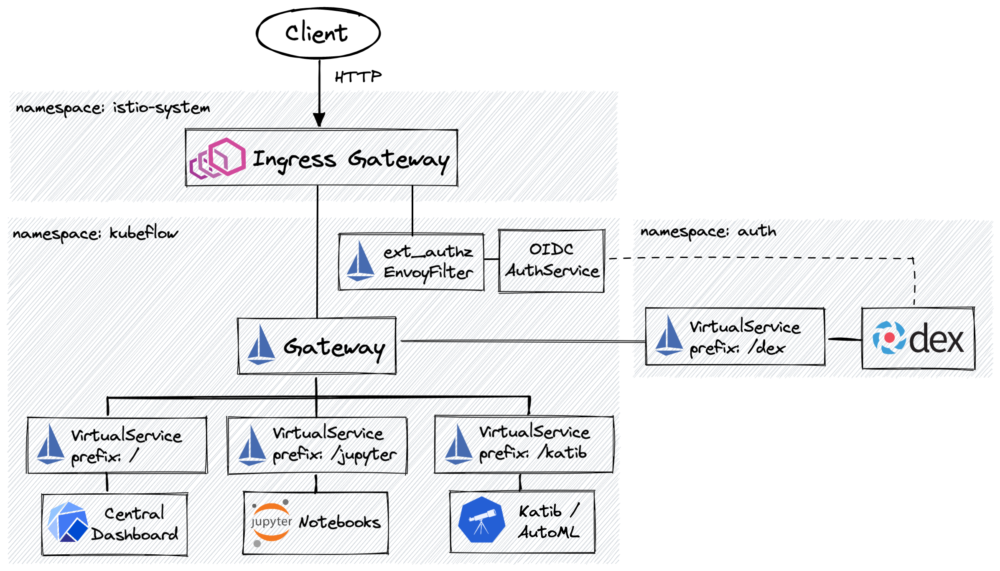
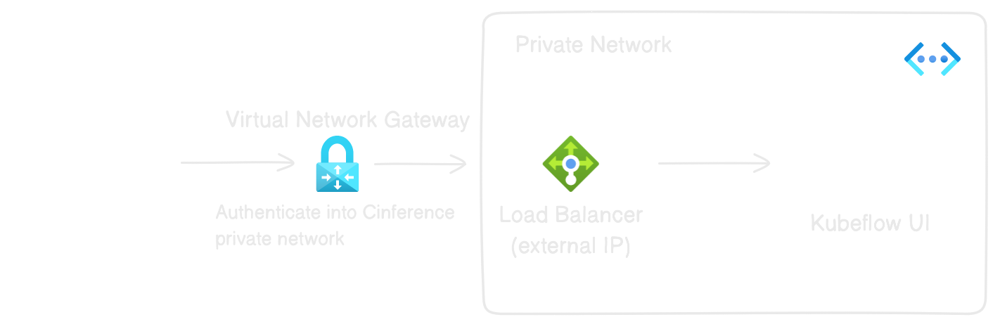

# Securing KF Network Traffic

Might be useful:
[Article](https://www.intel.com/content/www/us/en/developer/articles/technical/build-secure-kubeflow-pipelines-on-microsoft-azure.html)

VPN Gateway / Virtual Network Gateway:

## Proposed solution:

User -> VPN -> Private Network -> Kubeflow

