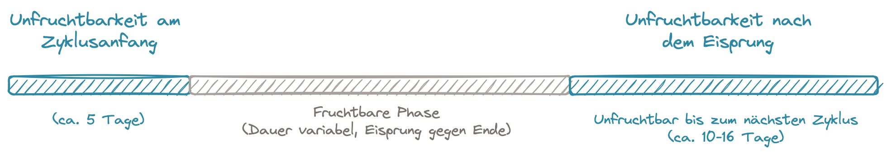

# NFP-Regeln

Zwei unfruchtbar Phasen:

- am Zyklusanfang (ca. 5 Tage)
- nach dem Eisprungo (ca. 10-15 Tage)

## Erkennung der unfruchtbaren Phase am Zyklusanfang

[Artikel](https://www.mynfp.de/unfruchtbarkeit-am-zyklusanfang)

"Vorhersage darüber, bis wann der Eisprung mit großer Wahrscheinlichkeit nicht stattfinden wird"

Mehrere Regeln, um eine Vorhersage machen zu können:

- **Zyklusanfang** : Zyklus beginnt am ersten Tag der Menstruation in gewöhnter Stärke
- **Vorbedingung** : vorherige Zyklus muss eine 1.hM aufweisen! Wenn diese im Vorgängerzyklus fehlt, gilt ab Tag 1 Fruchtbarkeit
- **Doppelte Kontrolle bei allen Regeln** : Wenn Schleim der Kategorie f, S oder S+ am Zyklusanfang, gilt ab sofort Fruchtbarkeit
- **5-Tage-Regel** : nur ersten 5 Tagen gelten als unfruchtbar, sofern Vorbedingung erfüllt ist
- **Minus-8-Regel zur Verkürzung**: Wenn 1 hM (höhere Messung) vor 13. Zyklustag, gilt ab sofort verkürzte unfruchtbare Zeit am Zyklusanfang
- **Minus-8-Regel zur Verlängerung**: 12 ausgewertete Zyklen (also 12 Zyklen mit 1.hM) => früheste 1.hM aller Zyklen – 8 = unfruchtbare Zeit am Zyklusanfang
- **Minus-20-Regel zur Verlängerung** : Menstruationskalender über die letzten 12 Zyklen geführt => Kürzeste Zykluslänge – 20 = unfruchtbare Zeit am Zyklusanfang

## Erkennung der unfruchtbaren Phase nach dem Eisprungo

[Artikel](https://www.mynfp.de/temperatur-und-zervixschleim-kombinieren)

[Zervixschleimanalyse](https://www.mynfp.de/zervixschleim-beobachten)

[Temperaturauswertung](https://www.mynfp.de/temperatur-auswerten)
